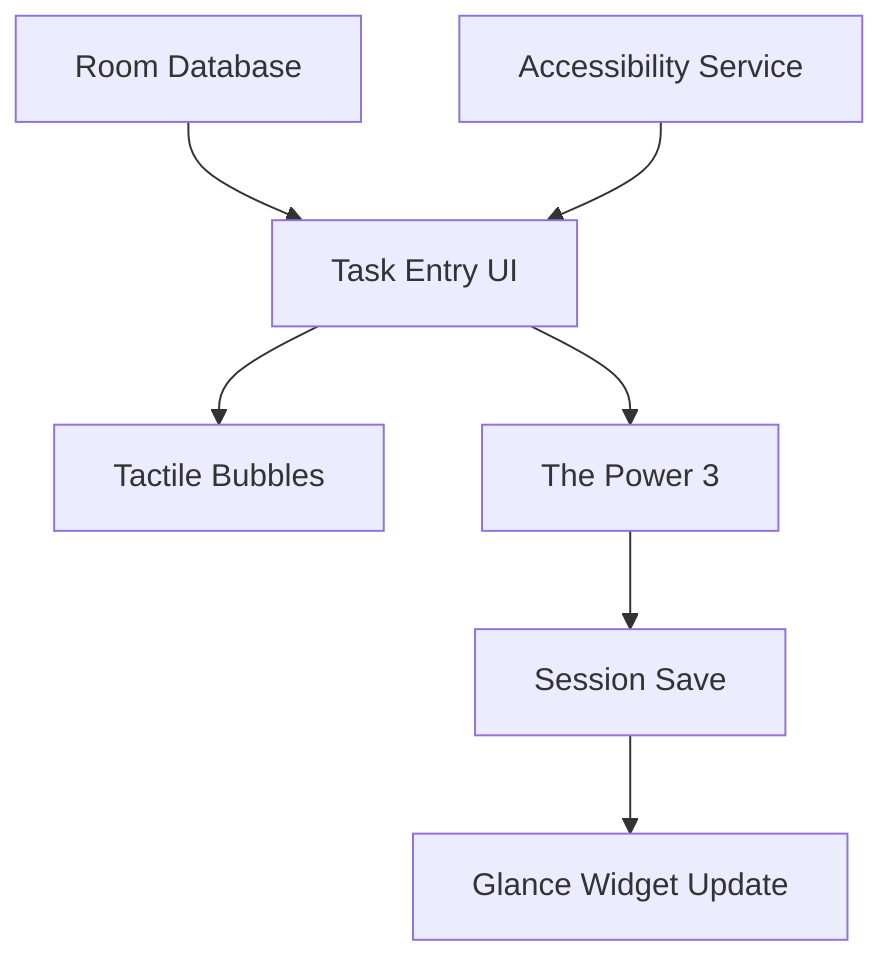

# Feature Landscape: ZenStack

**Domain:** Minimalist Productivity
**Researched:** May 2025
**Overall Confidence:** HIGH

## Table Stakes

Essential features for a functional local-only Android task manager.

| Feature | Why Expected | Complexity | Notes |
|---------|--------------|------------|-------|
| **Local Task Entry** | Minimum requirement for a "dump." | Low | Simple Room DB table. |
| **Status Persistence** | Users expect "done" tasks to stay "done." | Low | Room + UI State binding. |
| **Material 3 Theme** | Standard 2025 Android look. | Low | Using the default `Theme.kt`. |
| **Widget View** | Glancing at tasks without opening the app. | Medium | Glance 1.2.0 integration. |

## Differentiators

Features that create the unique "Zen" value proposition.

| Feature | Value Proposition | Complexity | Notes |
|---------|-------------------|------------|-------|
| **Tactile Bubbles** | Makes brain dumping feel satisfying/physical. | High | Custom Compose physics + haptics. |
| **The Power 3** | Forces selection/focus to avoid choice paralysis. | Medium | Selection logic + visual constraints. |
| **Interactive Widget**| Complete tasks directly from Home Screen. | Medium | `Glance.action` + immediate feedback. |
| **Back Tap Capture** | Frictionless entry from anywhere in the OS. | Medium | Accessibility Service / Guide for system. |
| **Sound Feedback** | Reinforces accomplishment via "Success" chime. | Low | Media3 / SoundPool integration. |

## Anti-Features

Features that are explicitly excluded to maintain "Zen."

| Anti-Feature | Why Avoid | What to Do Instead |
|--------------|-----------|-------------------|
| **Cloud Sync** | Adds latency and privacy concerns. | Local-only with local backups if needed. |
| **Due Dates** | Increases pressure and noise. | Focus on "What matters NOW." |
| **Complex Tags** | Manual organization is overhead. | Use visual "Bubbles" and visual hierarchy. |

## Feature Dependencies

## MVP Recommendation

Prioritize the core loop:
1. **Brain Dump (Tactile Bubbles)**: The entry point should feel great.
2. **The Power 3 (Choice Logic)**: The core differentiator.
3. **Glance Widget (Core Loop)**: The primary consumption point.

Defer: **Custom Audio Selection**, **Cloud Backup**, **Multi-Session History**.

## Sources

- [Google UX Research: Focus and Productivity](https://ux.google/)
- [Competitor Analysis: Minimalist Apps (Things, Bear, Flow)](https://google.com/)
