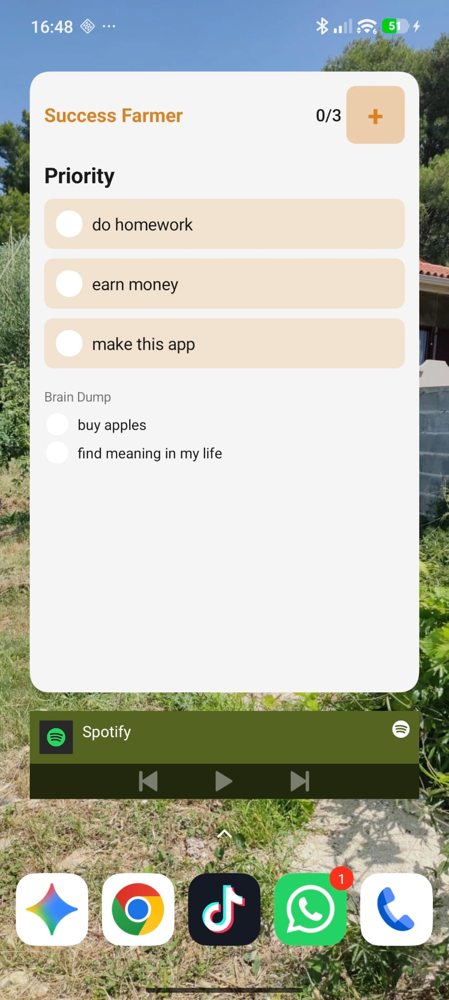
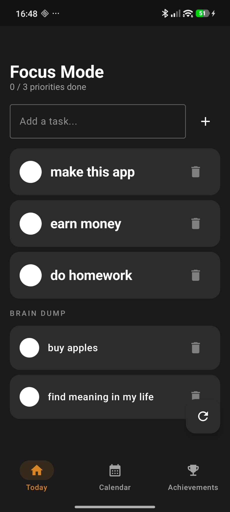
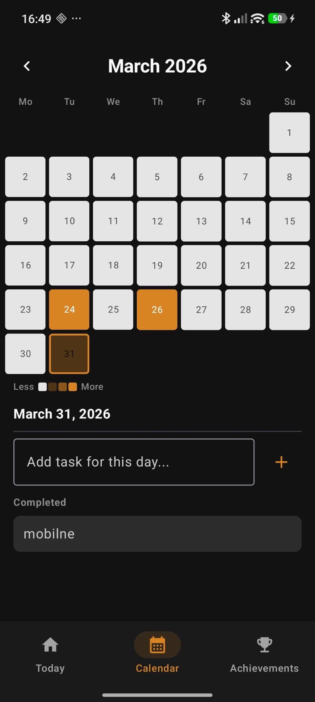
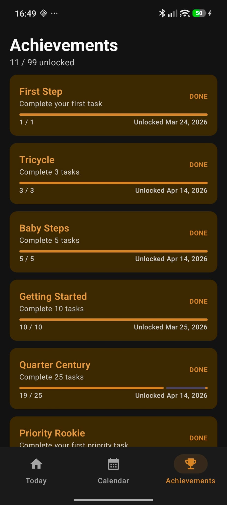

# Task Crusher

## Tired of over-complicated organization apps that end up wasting your time instead of helping you get things done?

**Task Crusher** is a simple, straight-to-the-point mobile app that doesn't waste your time. The goal is to spend as little time in the app as possible and as much time as possible actually crushing your tasks.

---

  
  
  
  

## Widget

The main feature of this app is the widget that lives on your home screen. You can't open your phone without seeing your tasks — keeping you focused every time you pick it up.

## Focus Mode

Clear your head and start organizing! Brain dump everything onto the list, then pick your **3 most important tasks** for the day — inspired by the time boxing method.

## Calendar

Your own Git-style activity tracker for tasks. See how active you've been and stay motivated by watching your streak grow.

## Achievements

All your accomplishments in one place. Track milestones, streaks, and personal records as you crush more and more tasks.
